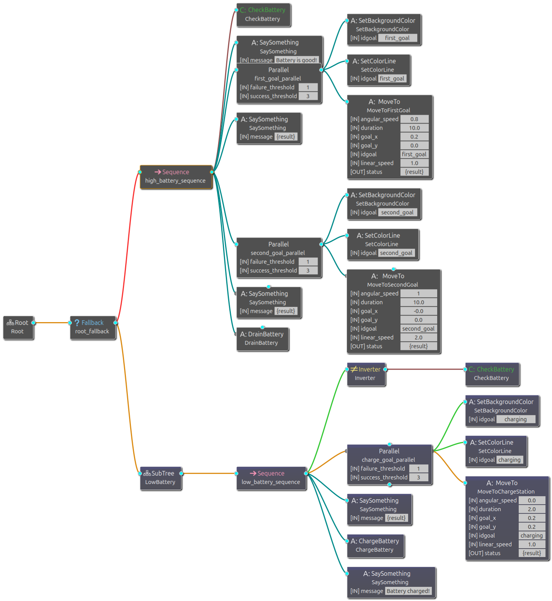
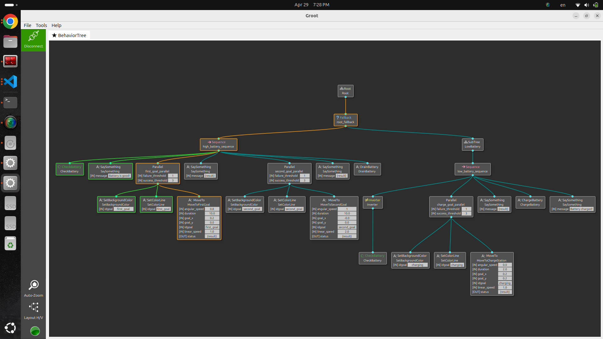
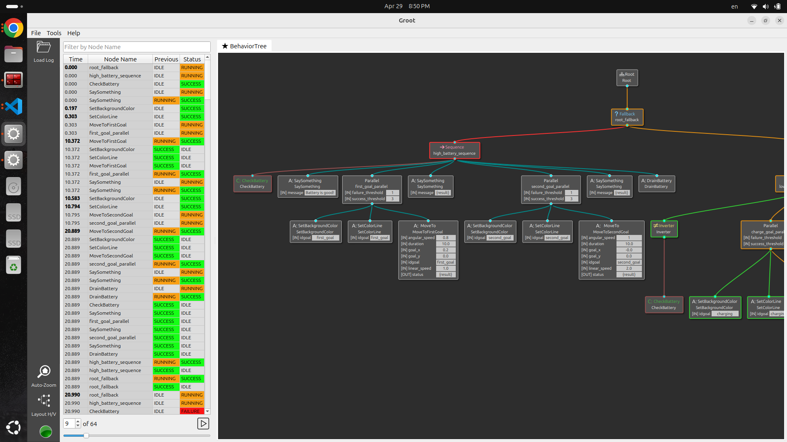

# ROS2 Behavior Tree for Turtlesim

This repository demonstrates a simple implementation of a Behavior Tree (BT) in ROS2, using a simulated turtle (`turtlesim`). The behavior tree controls the turtle's actions based on its battery level and the environment. The turtle moves toward a charging station if the battery is low, charges itself, and then moves toward a goal if the battery is sufficiently charged.

## Table of Contents
- [Demo](#-demo)
- [Overview](#overview)
- [Behavior Tree Architecture](#behavior-tree-architecture)
- [Setup](#setup)
- [Launch Instructions](#launch-instructions)
- [Behavior Trees and Groot](#behavior-trees-and-groot)

# 🎥 Demo


# Overview

This example integrates a Behavior Tree with a ROS 2 node (turtle_bt) to simulate decision-making behavior based on battery status. The turtle executes tasks by:

- **Checking battery level** and branching behavior accordingly.

- **Navigating to specified goals** with custom parameters (speed, orientation, and duration).

- **Providing visual cues** via dynamic **pen** and **background color changes** to indicate operational state.

- **Displaying status messages** to the console for easier debugging and state tracking.

This behavior is orchestrated using a Behavior Tree (defined in turtle_tree.xml), which is modular, readable, and easy to extend.


# Behavior Tree Architecture


The Behavior Tree is defined in XML and consists of two major paths:

### 1. High Battery Path
Executed when the battery level is **above 50%**:
- Say: "Battery is good!"
- Navigate to the **first goal**
  - Set pen color to **green**
  - Set background to **pink-purple**
- Say arrival message
- Navigate to the **second goal**
  - Set pen color to **purple**
  - Set background to **light blue**
- Say arrival message
- Drain the battery

### 2. Low Battery Path
Executed when the battery is **below 50%**:
- Move to the charging station
  - Set pen color to **gold**
  - Set background to **dark slate gray**
- Say: "Going to charge..."
- Charge the battery
- Say: "Battery charged!"

All logic is modular and defined via condition and action nodes in the XML.


---

# Setup

1. **Install ROS2**: This package was developed using ROS2. Make sure that you have ROS2 installed on your machine.

2. **Install Dependencies**:
   - `geometry_msgs`: Provides message types for motion commands.
   - `turtlesim`: Simulates a turtle in a 2D space.
   - [`behaviortree_cpp_v3`](https://github.com/BehaviorTree/BehaviorTree.CPP): Used for creating the behavior tree.
   - [`Groot`](https://github.com/BehaviorTree/Groot) : For visual editor and debugger for Behavior Trees

3. **Clone the Repository**:
   Clone this repository to your workspace and build the package.
   ```bash
   git clone https://github.com/sherif1152/Turtlesim_BT.git
   cd turtlesim_bt
   colcon build
   ```

4. **Source the Setup**:
   After building the package, source the workspace.
   ```bash
   source install/setup.bash
   ```
   ----


# Launch Instructions

Run the demo with the following command:
```bash
ros2 launch turtlesim_bt launch_turtlesim_bt.launch.py
```

You should see the turtle moving, changing pen and background colors, and reacting to battery state changes dynamically.


## Behavior Trees and Groot


#### What Are Behavior Trees?

**Behavior Trees** are a modern alternative to Finite State Machines (FSMs) used for decision-making in robotics and AI systems. They:

- Are modular and easier to debug

- Allow for fallback and sequential logic

- Separate **conditions** from **actions**

Behavior Trees are composed of control nodes (such as **Sequence**, **Fallback**) and leaf nodes (Conditions and Actions). In this project:

- CheckBattery is a condition node

- MoveTo, SetPen, SetBackground, Speak, and ChargeBattery are action nodes

- A **Sequence** node (→) executes its children from left to right and fails if any child fails.

- A **Fallback** node (?) attempts children in order and succeeds when the first child succeeds.

These provide clean and modular logic to build decision-making flows.

### Using Groot

#### What is Groot?
**Groot** is a graphical interface developed by the BehaviorTree.CPP authors to:

- Design Behavior Trees visually using XML

- Monitor BT execution in **real time**

- Replay logs from past BT runs for debugging and analysis

### 📡 Real-Time Monitoring in Groot

To visualize and debug the Behavior Tree in real time, Groot communicates with your application using **ZeroMQ (ZMQ)** over the local network.

#### 🛠️ How to Connect Groot
Make sure your BT application includes this line:

```cpp
BT::PublisherZMQ publisher(tree);
```

1. Run your ROS 2 BT application.

2. Open Groot and click on "`Monitor`" when prompted.

3. Groot will automatically connect to:
    - **`Server IP`** : **`localhost`** (or your machine's IP if connecting remotely)

    - **`Publisher Port`** : **`1666`** Live node status updates

    - **`Server Port`** : **`1667`** Behavior tree structure

You will see live updates with color-coded statuses:

- 🟩 Green: Success

- 🟨 Yellow: Running

- 🟥 Red: Failure



---------
### 📼 Log Replay in Groot

Groot includes a powerful **Log Replay** feature, which lets you visualize and analyze Behavior Tree executions **after they happen**, using saved logs.

#####  ✅ What You Can Do with Log Replay:
- Step through a previously executed Behavior Tree f**rame by frame**

- See the status of each node (Success, Failure, Running) **at each time step**

- Debug complex behaviors without rerunning the entire ROS 2 simulation

- Share logs with teammates for collaborative debugging or performance reviews

### 🛠 How to Use Log Replay
1. Generate a Log File
    In C++ code, make sure you log the BT execution using the `FileLogger`:

    ```cpp
    BT::FileLogger file_logger(tree, "bt_log.fbl");
    ```

    >💡 This generates a .fbl log file (e.g., bt_log.fbl) in your working directory.
    Ensure the path is writable and doesn't use hardcoded user-specific paths like /home/username.

2. Open Groot and click on "`Log Replay`" when prompted.

3. Load Your Log File

    - Select the .fbl file you previously recorded (e.g., bt_log.fbl).

    - Groot will load your behavior tree and the recorded execution timeline.

4. Replay and Analyze

    - Use the timeline controls (play, pause, step) to inspect the execution.

    - Watch each node change color over time (🟢 Success, 🔴 Failure, 🟡 Running).

    - Identify where things went wrong or verify that behaviors triggered as expected.



This integration makes it easy to iterate on logic design and monitor the runtime status of each node, including color-coded feedback and status updates.

## Check ZMQ 
Step 1 — Find what owns each port

for p in 1666 1667 1668 1669; do echo "--- port $p ---"; lsof -i :$p; done
This is the single most important command. It shows the PID and process name for every port. Example output:


--- port 1666 ---
COMMAND    PID  USER   TYPE  NODE NAME
turtle_bt  1234 rgt    IPv4  TCP *:1666 (LISTEN)
--- port 1668 ---
monitoring 5678 rgt    IPv4  TCP *:1668 (LISTEN)   ← stale crashed process
Step 2 — Kill the stale process

kill 5678   # use the PID from lsof output
Step 3 — Verify the binary is up to date

ls -la ~/rgt2_ws/install/turtlesim_bt/lib/turtlesim_bt/monitoring_nav2
If the timestamp is older than your last colcon build, you haven't sourced yet. The old binary still hardcodes port 1666.

Step 4 — Source and re-run

source ~/rgt2_ws/install/setup.bash
ros2 run turtlesim_bt monitoring_nav2 --ros-args -p nav2_namespace:=apple

## Tutorials

---

# How to Write a Behavior Tree Setup Node in ROS2

This tutorial walks through every concept demonstrated in `monitoring_nav2.cpp`.
It shows how to write custom BT nodes, wire them into a ROS2 node, load a tree
from XML, and stream live status to Groot.

---

## 1. Prerequisites

**Dependencies** (add to `package.xml` and `CMakeLists.txt`):
```xml
<depend>rclcpp</depend>
<depend>behaviortree_cpp_v3</depend>
<depend>ament_index_cpp</depend>
<depend>action_msgs</depend>
<depend>geometry_msgs</depend>
<depend>std_msgs</depend>
```

**Headers you will always need:**
```cpp
#include <rclcpp/rclcpp.hpp>
#include "ament_index_cpp/get_package_share_directory.hpp"
#include "behaviortree_cpp_v3/bt_factory.h"
#include "behaviortree_cpp_v3/loggers/bt_zmq_publisher.h"
#include "behaviortree_cpp_v3/loggers/bt_file_logger.h"
```

---

## 2. Shared ROS2 Node Pattern

BT node constructors cannot easily receive a `rclcpp::Node` via their config,
so the cleanest approach is a **file-scope shared pointer** that every custom
node uses:

```cpp
// Shared ROS2 node — all subscriptions live here.
static rclcpp::Node::SharedPtr g_ros_node;

// Optional: shared configuration values read from ROS parameters.
static std::string g_nav2_namespace;
```

**Why this works:** `behaviortree_cpp_v3` constructs every registered node
inside `factory.createTreeFromFile()`. By the time constructors run,
`g_ros_node` and any global config are already populated (see Section 7).

---

## 3. The Four BT Node Base Classes

| Base class | When to use |
|---|---|
| `BT::SyncActionNode` | Completes immediately — no async work |
| `BT::StatefulActionNode` | Long-running action with `onStart()` / `onRunning()` / `onHalted()` |
| `BT::ControlNode` | Custom control flow (e.g. `PipelineSequence`) |
| `BT::DecoratorNode` | Wraps exactly one child (e.g. `RateController`, `GoalUpdater`) |

---

## 4. Writing a SyncActionNode

Use this for nodes that return `SUCCESS` or `FAILURE` in a single tick.

```cpp
class ControllerSelector : public BT::SyncActionNode
{
    rclcpp::Subscription<std_msgs::msg::String>::SharedPtr sub_;
    std::string selected_;

public:
    // Constructor: receives the node name and its BT configuration.
    // Create subscriptions here — they persist for the node's lifetime.
    ControllerSelector(const std::string& name, const BT::NodeConfiguration& config)
        : BT::SyncActionNode(name, config)
    {
        auto topic = getInput<std::string>("topic_name").value_or("controller_selector");
        sub_ = g_ros_node->create_subscription<std_msgs::msg::String>(
            "/" + topic, rclcpp::QoS(1).transient_local(),
            [this](const std_msgs::msg::String::SharedPtr msg) {
                selected_ = msg->data;
            });
    }

    // Declare every port the XML can set or read.
    static BT::PortsList providedPorts()
    {
        return {
            BT::InputPort<std::string>("topic_name", "controller_selector", "Relative topic"),
            BT::InputPort<std::string>("default_controller", "FollowPath", "Default value"),
            BT::OutputPort<std::string>("selected_controller"),
        };
    }

    // Called every BT tick.
    BT::NodeStatus tick() override
    {
        rclcpp::spin_some(g_ros_node);   // drain the ROS callback queue
        auto def = getInput<std::string>("default_controller").value_or("FollowPath");
        setOutput("selected_controller", selected_.empty() ? def : selected_);
        return BT::NodeStatus::SUCCESS;
    }
};
```

**Key rules:**
- Always call `rclcpp::spin_some(g_ros_node)` inside `tick()` to process
  incoming messages before reading them.
- `getInput<T>()` returns `BT::Expected<T>` — use `.value_or(default)` or
  check `.has_value()`.
- `setOutput()` writes a value to the BT blackboard so other nodes can read it.

---

## 5. Writing a StatefulActionNode

Use this when the underlying operation is **asynchronous** (e.g. monitoring an
action server). The BT framework calls `onStart()` once, then `onRunning()` on
every subsequent tick until it returns `SUCCESS` or `FAILURE`.

```cpp
class ComputePathToPose : public BT::StatefulActionNode
{
    rclcpp::Subscription<action_msgs::msg::GoalStatusArray>::SharedPtr sub_;
    action_msgs::msg::GoalStatusArray::SharedPtr last_status_;

public:
    ComputePathToPose(const std::string& name, const BT::NodeConfiguration& config)
        : BT::StatefulActionNode(name, config)
    {
        sub_ = g_ros_node->create_subscription<action_msgs::msg::GoalStatusArray>(
            "/compute_path_to_pose/_action/status", 10,
            [this](const action_msgs::msg::GoalStatusArray::SharedPtr msg) {
                last_status_ = msg;
            });
    }

    static BT::PortsList providedPorts()
    {
        return {
            BT::InputPort<std::string>("goal"),
            BT::OutputPort<std::string>("path"),
        };
    }

    // Called once when the node transitions from IDLE → RUNNING.
    BT::NodeStatus onStart() override { return onRunning(); }

    // Called every tick while the node is RUNNING.
    BT::NodeStatus onRunning() override
    {
        rclcpp::spin_some(g_ros_node);
        if (!last_status_ || last_status_->status_list.empty())
            return BT::NodeStatus::RUNNING;

        uint8_t s = last_status_->status_list.back().status;
        using S = action_msgs::msg::GoalStatus;
        if (s == S::STATUS_EXECUTING || s == S::STATUS_ACCEPTED)
            return BT::NodeStatus::RUNNING;
        if (s == S::STATUS_SUCCEEDED) {
            setOutput("path", "computed");
            return BT::NodeStatus::SUCCESS;
        }
        return BT::NodeStatus::FAILURE;
    }

    // Called when a parent control node halts this node mid-execution.
    void onHalted() override {}
};
```

---

## 6. Writing a DecoratorNode

A decorator wraps **exactly one child** and modifies how or when it is ticked.

### RateController — limit child tick frequency

```cpp
class RateController : public BT::DecoratorNode
{
    double hz_;
    rclcpp::Time last_tick_time_;
    BT::NodeStatus last_child_status_ = BT::NodeStatus::RUNNING;

public:
    RateController(const std::string& name, const BT::NodeConfiguration& config)
        : BT::DecoratorNode(name, config)
    {
        hz_ = getInput<double>("hz").value_or(1.0);
        last_tick_time_ = rclcpp::Time(0, 0, RCL_ROS_TIME);
    }

    static BT::PortsList providedPorts()
    {
        return { BT::InputPort<double>("hz", 1.0, "Tick rate in Hz") };
    }

    BT::NodeStatus tick() override
    {
        if ((g_ros_node->now() - last_tick_time_).seconds() >= 1.0 / hz_)
        {
            last_tick_time_ = g_ros_node->now();
            last_child_status_ = child_node_->executeTick();  // tick the child
        }
        return last_child_status_;  // return cached status between ticks
    }
};
```

### GoalUpdater — pass data through while ticking child

```cpp
class GoalUpdater : public BT::DecoratorNode
{
    rclcpp::Subscription<geometry_msgs::msg::PoseStamped>::SharedPtr sub_;
    geometry_msgs::msg::PoseStamped latest_goal_;

public:
    GoalUpdater(const std::string& name, const BT::NodeConfiguration& config)
        : BT::DecoratorNode(name, config)
    {
        sub_ = g_ros_node->create_subscription<geometry_msgs::msg::PoseStamped>(
            "/goal_update", 10,
            [this](const geometry_msgs::msg::PoseStamped::SharedPtr msg) {
                latest_goal_ = *msg;
            });
    }

    static BT::PortsList providedPorts()
    {
        return {
            BT::InputPort<std::string>("input_goal"),
            BT::OutputPort<std::string>("output_goal"),
        };
    }

    BT::NodeStatus tick() override
    {
        rclcpp::spin_some(g_ros_node);
        // Write updated data to the blackboard before ticking the child.
        setOutput("output_goal", std::to_string(latest_goal_.pose.position.x));
        return child_node_->executeTick();  // always tick the child
    }
};
```

---

## 7. Writing a Custom ControlNode

A control node manages **multiple children**. Implement your own sequencing or
fallback strategy by overriding `tick()`.

```cpp
class PipelineSequence : public BT::ControlNode
{
public:
    PipelineSequence(const std::string& name, const BT::NodeConfiguration& config)
        : BT::ControlNode(name, config) {}

    static BT::PortsList providedPorts() { return {}; }

    // Ticks ALL children every tick.
    // Returns FAILURE immediately if any child fails; otherwise RUNNING.
    BT::NodeStatus tick() override
    {
        for (auto* child : children_nodes_)
        {
            auto status = child->executeTick();
            if (status == BT::NodeStatus::FAILURE)
            {
                haltChildren();           // stop all children cleanly
                return BT::NodeStatus::FAILURE;
            }
        }
        return BT::NodeStatus::RUNNING;
    }
};
```

---

## 8. Defining Ports

Ports are the interface between the XML tree and your C++ node. They connect to
the **BT blackboard** using `{key}` syntax in XML.

```cpp
static BT::PortsList providedPorts()
{
    return {
        // InputPort<Type>("xml_attr_name", default_value, "description")
        BT::InputPort<std::string>("topic_name", "controller_selector", "ROS topic"),
        BT::InputPort<double>("hz", 1.0, "Rate in Hz"),

        // OutputPort<Type>("xml_attr_name")  — no default; must be set by the node
        BT::OutputPort<std::string>("selected_controller"),
        BT::OutputPort<std::string>("path"),
    };
}
```

**In the XML**, use `{key}` to connect two nodes via the shared blackboard:
```xml
<ControllerSelector selected_controller="{selected_controller}" topic_name="controller_selector"/>
<FollowPath controller_id="{selected_controller}"/>
```

---

## 9. The main() Setup Sequence

```cpp
int main(int argc, char** argv)
{
    rclcpp::init(argc, argv);

    // ── Step 1: Create the ROS2 node and read parameters FIRST ──────────────
    // BT node constructors (called inside createTreeFromFile) use these globals,
    // so they must be set before the factory registers anything.
    g_ros_node = rclcpp::Node::make_shared("my_bt_node");
    g_ros_node->declare_parameter("nav2_namespace", std::string(""));
    g_nav2_namespace = g_ros_node->get_parameter("nav2_namespace").as_string();

    // ── Step 2: Register every custom node type ──────────────────────────────
    BehaviorTreeFactory factory;

    // Control nodes
    factory.registerNodeType<PipelineSequence>("PipelineSequence");

    // Decorator nodes
    factory.registerNodeType<RateController>("RateController");
    factory.registerNodeType<GoalUpdater>("GoalUpdater");
    // NOTE: built-in decorators like KeepRunningUntilFailure must NOT
    //       be registered — doing so throws a duplicate-registration error.

    // Action nodes
    factory.registerNodeType<ControllerSelector>("ControllerSelector");
    factory.registerNodeType<ComputePathToPose>("ComputePathToPose");
    factory.registerNodeType<FollowPath>("FollowPath");

    // ── Step 3: Load the tree from an XML file ───────────────────────────────
    std::string pkg_share = ament_index_cpp::get_package_share_directory("my_package");
    auto tree = factory.createTreeFromFile(pkg_share + "/config/my_tree.xml");

    // ── Step 4: Attach loggers ───────────────────────────────────────────────
    // File logger — for Groot Log Replay.
    BT::FileLogger file_logger(tree, "/tmp/bt_log.fbl");

    // ZMQ publisher — for Groot Real-time monitoring.
    // publisher_port (default 1666): streams node status.
    // server_port    (default 1667): serves tree structure.
    int zmq_pub_port = 1669;   // use non-default ports if another BT already
    int zmq_srv_port = 1670;   // owns 1666/1667.
    BT::PublisherZMQ zmq_publisher(tree, 25, zmq_pub_port, zmq_srv_port);

    // ── Step 5: Tick loop ────────────────────────────────────────────────────
    rclcpp::Rate rate(10);   // 10 Hz
    while (rclcpp::ok())
    {
        tree.tickRoot();
        rclcpp::spin_some(g_ros_node);
        rate.sleep();
    }

    rclcpp::shutdown();
    return 0;
}
```

---

## 10. The XML Tree File

The XML mirrors the registered C++ node names exactly. Blackboard keys use
`{curly_braces}`:

```xml
<root BTCPP_format="4" main_tree_to_execute="MainTree">
  <BehaviorTree ID="MainTree">
    <PipelineSequence name="NavigateWithReplanning">
      <ControllerSelector
          selected_controller="{selected_controller}"
          default_controller="FollowPath"
          topic_name="controller_selector"/>
      <RateController hz="1.0">
        <Sequence name="PlanAndTruncate">
          <GoalUpdater input_goal="{goal}" output_goal="{updated_goal}">
            <ComputePathToPose goal="{updated_goal}" path="{path}"/>
          </GoalUpdater>
        </Sequence>
      </RateController>
      <KeepRunningUntilFailure>
        <FollowPath path="{path}" controller_id="{selected_controller}"/>
      </KeepRunningUntilFailure>
    </PipelineSequence>
  </BehaviorTree>
</root>
```

**Rules:**
- The XML tag name must match the string passed to `registerNodeType<>()`.
- Attribute names must match the port names declared in `providedPorts()`.
- Built-in nodes (`Sequence`, `Fallback`, `KeepRunningUntilFailure`, etc.)
  are available without registration.

---

## 11. Quick Reference — Node Status

| Status | Meaning |
|---|---|
| `BT::NodeStatus::SUCCESS` | Node completed successfully |
| `BT::NodeStatus::FAILURE` | Node failed; parent will react (retry, fallback…) |
| `BT::NodeStatus::RUNNING` | Node is still working; will be ticked again next cycle |

---

## 12. Connecting Groot

| Mode | What it shows | How to open |
|---|---|---|
| **Real-time** | Live node colors (green/yellow/red) during execution | Groot → Monitor → `localhost:1666/1667` |
| **Log Replay** | Frame-by-frame replay from `.fbl` file | Groot → Log Replay → select `.fbl` file |

> If ports 1666/1667 are already in use by another BT process, pass different
> ports to `PublisherZMQ` and declare them as ROS parameters so they can be
> changed at launch time without recompiling.

